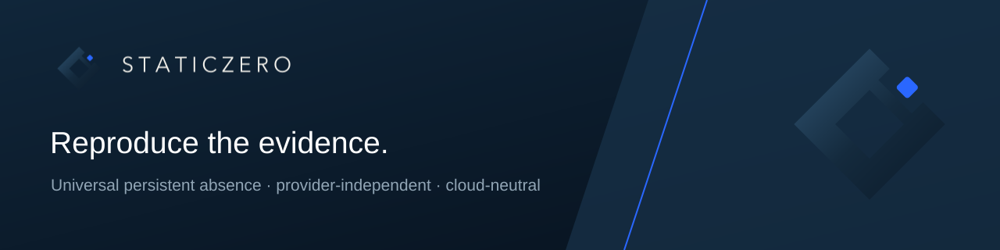

# STATICZERO™

STATICZERO™ is a universal, independent and cloud-neutral architecture that proves persistent absence.

`STATICZERO_TECHNICAL_CONFORMANCE=CLOSED_PASS`

## Run it. See for yourself.

Run STATICZERO in your environment. Measure the difference. See the value in
your own numbers.

- Impact Experience: https://staticzero.online/impact/
- English Impact Experience: https://staticzero.online/en/impact/
- [Download the public runner](https://github.com/danishlogic0/staticzero-public-benchmark/releases/latest/download/staticzero-impact-experience-001.tar.gz)
- [Verify the public bundle metadata](https://github.com/danishlogic0/staticzero-public-benchmark/releases/latest/download/PUBLIC_BUNDLE.json)

Your environment. Your workload. Your measured STATICZERO impact.

## Business value

Measure what STATICZERO changes in:

- cloud and infrastructure economics;
- latency, execution performance and resource use;
- persistent exposure and security position;
- infrastructure independence and portability;
- operational flow, retries and complexity; and
- customer-specific monthly and annual value.

The official public website presents approved commercial information, documented value and contact routes:

- Website: https://staticzero.online/
- Impact and value: https://staticzero.online/impact/
- Results and evidence: https://staticzero.online/evidens/
- Contact: https://staticzero.online/kontakt/
- English: https://staticzero.online/en/

## Collaboration

Measured impact can lead to a Workload License, Capability License, Enterprise
License, Tailored Deployment, Partnership or an optional Structured Evaluation.

## Reproduce the evidence

The release artifacts include the public Impact runner, exact bundle metadata,
an integrity seal and checksum manifest. Technical details remain available as
drill-down while the customer journey stays focused on measurable outcomes.

## Intellectual-property boundary

The proprietary implementation, source code, algorithms, internal mechanisms, architecture details, validation internals, deployment material and patent-sensitive information are not published in this repository.

Additional information may be considered only within an appropriate scope, confidentiality and rights framework.

## Rights

STATICZERO™ by Danish Logic-0™ is a protected trademark owned by Karla Rose Claire Farah.

Trademark right: VA 2026 00057.

© 2026 Karla Rose Claire Farah. All rights reserved.
